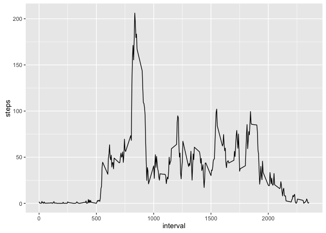

# Reproducible Research: Peer Assessment 1

##Introduction

It is now possible to collect a large amount of data about personal movement using activity monitoring devices such as a Fitbit, Nike Fuelband, or Jawbone Up. These type of devices are part of the “quantified self” movement – a group of enthusiasts who take measurements about themselves regularly to improve their health, to find patterns in their behavior, or because they are tech geeks. But these data remain under-utilized both because the raw data are hard to obtain and there is a lack of statistical methods and software for processing and interpreting the data.

This assignment makes use of data from a personal activity monitoring device. This device collects data at 5 minute intervals through out the day. The data consists of two months of data from an anonymous individual collected during the months of October and November, 2012 and include the number of steps taken in 5 minute intervals each day.


The data for this assignment was downloaded from the course web site and placed at 

~/Downloads/activity.csv

The variables included in this dataset are:

steps: Number of steps taking in a 5-minute interval (missing values are coded as NA)

date: The date on which the measurement was taken in YYYY-MM-DD format

interval: Identifier for the 5-minute interval in which measurement was taken

The dataset is stored in a comma-separated-value (CSV) file and there are a total of 17,568 observations in this dataset.

The Introductory text was taken directly from the class website with only a small variation:
https://class.coursera.org/repdata-034/human_grading/view/courses/975147/assessments/3/submissions


## Load a few really useful libraries


```r
library(ggplot2)
library(dplyr)
```

```
## 
## Attaching package: 'dplyr'
## 
## The following objects are masked from 'package:stats':
## 
##     filter, lag
## 
## The following objects are masked from 'package:base':
## 
##     intersect, setdiff, setequal, union
```

```r
library(data.table)
```

```
## 
## Attaching package: 'data.table'
## 
## The following objects are masked from 'package:dplyr':
## 
##     between, last
```

```r
library(lubridate)
```

```
## 
## Attaching package: 'lubridate'
## 
## The following objects are masked from 'package:data.table':
## 
##     hour, mday, month, quarter, wday, week, yday, year
```

```r
library(lattice) 
```

## Loading and preprocessing the data

First we are going to use the fread function from the data.table library read in the data.


```r
d <- fread("~/Downloads/activity.csv", header=TRUE)
```


Once the data is loaded we are going to select only the columns that we need at this point (steps and date), we are then going to group the data by the date column, we are then going to transform the dataframe so that the steps column now contains the total number of steps for that day.


```r
dd <- d  %>%  select(steps, date) %>% group_by(date) %>% summarise( steps = sum(steps, na.rm = TRUE))

dd
```

```
## Source: local data table [61 x 2]
## 
##          date steps
##         (chr) (int)
## 1  2012-10-01     0
## 2  2012-10-02   126
## 3  2012-10-03 11352
## 4  2012-10-04 12116
## 5  2012-10-05 13294
## 6  2012-10-06 15420
## 7  2012-10-07 11015
## 8  2012-10-08     0
## 9  2012-10-09 12811
## 10 2012-10-10  9900
## ..        ...   ...
```

## What is mean total number of steps taken per day?


As we are asked to do we are going to now graph a histogram of the number of steps taken in a day.  I have chosen to use the qplot funcion from ggplot2 to make the graph.


```r
qplot(x=steps, data=dd, geom="histogram")
```

```
## stat_bin: binwidth defaulted to range/30. Use 'binwidth = x' to adjust this.
```

 


The mean of the daily total number of steps is

```r
mean(dd$steps)
```

```
## [1] 9354.23
```

The median of the daily total number of steps is

```r
median(dd$steps)
```

```
## [1] 10395
```


## What is the average daily activity pattern?

We don't need to load the data in again.  We are going to select only the columns that we need at this point (steps and interval), we are then going to group the data by the interval column, we are then going to transform the dataframe so that the steps column now contains the total number of steps for that interval.


```r
ee <- d  %>%  select(steps, interval) %>% group_by(interval) %>% summarise( steps = mean(steps, na.rm = TRUE))

ee
```

```
## Source: local data table [288 x 2]
## 
##    interval     steps
##       (int)     (dbl)
## 1         0 1.7169811
## 2         5 0.3396226
## 3        10 0.1320755
## 4        15 0.1509434
## 5        20 0.0754717
## 6        25 2.0943396
## 7        30 0.5283019
## 8        35 0.8679245
## 9        40 0.0000000
## 10       45 1.4716981
## ..      ...       ...
```

And we can then plot it to see what an average day looks like:


```r
qplot(x=interval, y=steps, data=ee, geom="line")
```

 


The interval with the greatest average number of steps can be found using the following:


```r
ee %>% arrange(desc(steps)) %>% slice( 1) %>% select(interval)
```

```
## Source: local data table [1 x 1]
## 
##   interval
##      (int)
## 1      835
```


## Imputing missing values

In this section of the assignment we are first asked to "calculate and report the total number of missing values in the dataset (i.e. the total number of rows with NAs)." Thus, I am going to subset the dataframe so that only the rows that have non-NA values are kept, I am then going to use the length function in finding the difference between the original data and the subsetted data.


```r
b <- d[complete.cases(d),]

number_of_NAs <- length(d$steps) - length(b$steps)

number_of_NAs
```

```
## [1] 2304
```


We are then asked to "Devise a strategy for filling in all of the missing values in the dataset."  I am going to follow the recommendation where if an interval is missing a value in steps I will replace the NA with the "mean for that 5-minute interval."  To do this I will create the function correcting_steps.


```r
correcting_steps <- function(intval, step){
            if (is.na(step)){
                 xy <-  filter(ee, interval == intval) #using the dataframe ee from earlier
                 xyy <- xy$steps 
                 x <- xyy[1]
            }  else {
                   x <- step
            }
x}
```


Applying the function to the steps data

```r
corrected_steps <- mapply(correcting_steps, d$interval, d$steps)
```

We now use cbind to attach corrected_steps to d.

```r
corrected_d <- cbind(d,corrected_steps)
```


Once the data is loaded we are going to select only the columns that we need at this point (steps and date), we are then going to group the data by the date column, we are then going to transform the dataframe so that the steps column now contains the total number of steps for that day.


```r
corrected_dd <- corrected_d  %>%  select(corrected_steps, date) %>% group_by(date) %>% summarise( steps = sum(corrected_steps, na.rm = TRUE))

dd
```

```
## Source: local data table [61 x 2]
## 
##          date steps
##         (chr) (int)
## 1  2012-10-01     0
## 2  2012-10-02   126
## 3  2012-10-03 11352
## 4  2012-10-04 12116
## 5  2012-10-05 13294
## 6  2012-10-06 15420
## 7  2012-10-07 11015
## 8  2012-10-08     0
## 9  2012-10-09 12811
## 10 2012-10-10  9900
## ..        ...   ...
```


Wwe are going to now graph a histogram of the number of steps taken in a day.  I have chosen to use the qplot funcion from ggplot2 to make the graph.


```r
qplot(x=steps, data=corrected_dd, geom="histogram")
```

```
## stat_bin: binwidth defaulted to range/30. Use 'binwidth = x' to adjust this.
```

 

Comparing daily total number of steps histograms we see that by adding in the missing data the data goes from being a non-normal distribution to a more normal distribution.


The mean of the daily total number of steps is

```r
mean(corrected_dd$steps)
```

```
## [1] 10766.19
```

The median of the daily total number of steps is

```r
median(corrected_dd$steps)
```

```
## [1] 10766.19
```

After the correction the mediam and mean values are much closer together.


## Are there differences in activity patterns between weekdays and weekends?

I am going to start the original data, d, and then apply the function correcting_steps. The function wd will create a new factor variable in the dataset with two levels – “weekday” and “weekend” indicating whether a given date is a weekday or weekend day. 


```r
wd <- function(x){
   y <- weekdays(ymd(x))
   
   if (y == "Saturday"){
       z <- "Weekend"
    } else if (y == "Sunday"){
       z <- "Weekend"
    } else {
       z <- "Weekday"
    }
z}
```

Using the wd function I am going to create a variable called day which will then be added to the original data frame using cbind.  Use of select, group_by, and summarise will transform the data into the desired structure.


```r
day <- simplify2array(lapply(d$date, wd))

DAYS <- cbind(d, day) %>% select(interval, day, steps) %>% group_by(interval, day) %>% summarise( steps = mean(steps, na.rm = TRUE))
```


Below is a panel plot containing a time series plot of the 5-minute interval (x-axis) and the average number of steps taken, averaged across all weekday days or weekend days (y-axis).


```r
xyplot(steps~interval | day, data=DAYS, type = "l", layout=c(1,2))
```

 


Comparing the graphs shows that on the weekdays people get up earlier than on the weekends.  While the maximum number of steps is higher during the weekday, there tends to be more steps per time period on the weekends.


